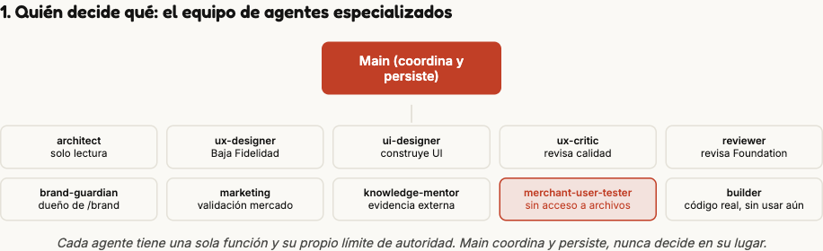
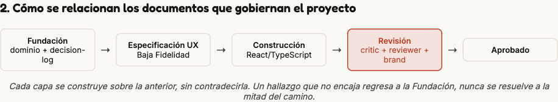
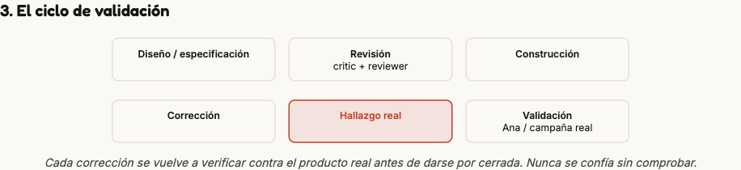
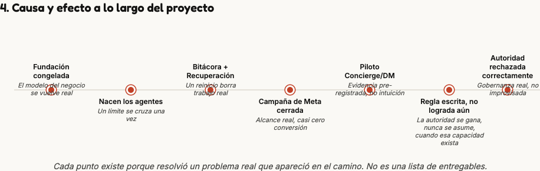

# Nahui, Documento Ejecutivo, Demo Day

**Curso:** TI-4041, Transformación Digital en la Empresa. **Autora:** Claudia Falcón. **Estado: BORRADOR, sin revisión final.** Integra el trabajo de las Sesiones 1 a 7 en una sola propuesta, con la misma disciplina de evidencia que he usado desde la Sesión 1: **Real** (dato confirmado), **Proyectado** (estimación razonada, no confirmada), **Calculado** (resultado de una fórmula).

---

## 1. El problema

El comercio informal en México no es un caso marginal, aportó **25.4% del PIB en 2024**, y los micronegocios (changarros, puestos, autoempleo) siguieron abriéndose a un ritmo de **3.3% más en 2025** (INEGI; El Financiero, jul. 2026). Nahui ataca la ineficiencia más urgente dentro de ese segmento, validada con Ana, vendedora independiente de ropa en bazares del Estado de México, y confirmada con una fuente independiente además de su propio testimonio.

**La ineficiencia:** el flujo de clientes en un bazar es completamente impredecible. Cuando alguien está frente al puesto listo para comprar, cualquier proceso de registro que tome más de unos segundos compite directamente con atender a la siguiente persona, y siempre gana la siguiente venta. El resultado no es solo una venta sin anotar, es un techo real de crecimiento. Ana limita su catálogo deliberadamente a tres líneas de producto (pijamas, sudaderas/maxys, calcetines) porque sabe que con más variedad "ya perdería el control", palabras textuales de la entrevista original de Sesión 1. No tengo una cifra exacta de ventas perdidas de parte de Ana, ella no me la dio. Sí tengo evidencia de industria: negocios que llevan el control de memoria o en notas sueltas terminan con desabasto de lo que más se vende y exceso de lo que no se mueve, perdiendo dinero sin darse cuenta (Clip, blog especializado en pagos y ventas).

**A quién afecta:** vendedoras itinerantes de bazares (renta privada) y tianguis (permiso municipal) en general. Ana es el caso concreto y verificable, no el límite del problema.

---

## 2. La solución

Nahui es una app de registro de ventas y business intelligence, pensada para que la tecnología desaparezca justo en el momento donde antes fallaba. El flujo, desde donde lo vive Ana: llega el cliente, ella cierra la venta en su celular en segundos, sin perder de vista al siguiente cliente que puede llegar en cualquier momento.

**Lo que puede hacer hoy que antes no podía:** registrar una venta real en el momento exacto en que ocurre, sin que el registro le cueste la siguiente venta. Es el job funcional que la libreta, la memoria, y las terminales de pago (que solo registran cuando hay tarjeta, no efectivo) no le resuelven hoy. Ya existe un prototipo funcional real, construido y probado con Ana.

**Cómo se construyó, y por qué eso también es parte de "cómo funciona":** Nahui no la construí sola con ayuda de un asistente de IA. La construye un equipo real de agentes de IA especializados, cada uno con autoridad propia sobre su área (diseño de producto, revisión de marca, arquitectura, marketing, validación), coordinados bajo un marco explícito de quién decide qué. No es una metáfora de gestión de proyecto, es literalmente cómo se tomó cada decisión de este documento. El detalle completo de cómo funciona esa arquitectura está en el Anexo A.

---

## 3. Validación

**Qué esperaba, y el umbral fijado antes de probar:** desde el principio, antes de cualquier prueba con usuarios, definí la barra de éxito exacta: **90% o más de las ventas registradas, en menos de 3 segundos por registro.** No es un umbral inventado después del resultado, es la definición original del éxito del MVP.

**Qué pasó:** Ana usó el producto real y le encantó, evidencia cualitativa real, de primera mano, no una intuición mía. Una campaña de Meta que acabo de cerrar generó alcance real y barato ($530 MXN gastados, 19,268 personas de alcance, $0.81 MXN por clic, el costo de atraer atención no es el problema) pero prácticamente cero comerciantes reales, fuera de Ana y de mi propio equipo, llegaron a probar el demo. La causa exacta todavía no está confirmada.

**Qué decidí:** no escalar el gasto publicitario sobre una causa que no he confirmado. En vez de eso, diseñé un piloto pequeño y controlado (Concierge/DM, MXN $200, tope de 20 conversaciones, ventana de 2 días) con un marco de evidencia definido antes de la primera conversación: cinco hipótesis candidatas de por qué no están entrando, incluida una hipótesis nula, para que el marco no me pueda forzar a una conclusión de producto por diseño. Es una decisión de iterar en cómo aprendo, no de escalar ni de descartar el canal.

**Límite de esta validación:** toda la experiencia de uso real hasta hoy viene de una sola persona, observada de cerca por mí y mi equipo. Es evidencia real, pero de un solo caso, no de una comunidad.

---

## 4. Viabilidad

**Dimensión de captura de valor:** Operaciones, el registro reduce fricción operativa directa en el momento de la venta. La dimensión de Ecosistema (efecto de red entre bazares) es la fase futura, no la de hoy (ver Sección 7).

**Métrica de Innovation Accounting, Nivel 1:** % de ventas registradas en menos de 3 segundos, el mismo umbral fijado en el backlog, ahora como métrica viva de dashboard, no solo como meta.

**Viabilidad técnica, las cuatro preguntas:**
- **Datos:** el modelo de dominio ya está congelado (`Sale`, `SaleItem`, `Session`, `Event`, `Product`, `Business`). Nada nuevo que inventar, solo persistirlo en una base real.
- **Infraestructura:** React + TypeScript (PWA) en Vercel. Backend en Supabase (Postgres + Auth + Storage + Edge Functions), paquete de un solo proveedor que elegí el 2026-08-12 sobre un stack por componente, priorizando menos proveedores a esta escala piloto.
- **Integraciones:** autenticación por teléfono más código OTP vía Supabase Auth, ya decidido. Lectura NFC, resuelta: en Android uso Web NFC dentro del mismo PWA, sin ningún cambio. Web NFC no funciona en iOS Safari, así que para iOS envuelvo el mismo código en un shell nativo delgado con un puente a Core NFC, solo para esa función específica, no una segunda app nativa completa. El requisito real de negocio, que Ana nunca necesite comprar un lector aparte, queda cubierto en ambos casos.
- **Capacidades humanas:** una persona con dominio de React/TypeScript y del modelo de dominio para construir. Para operar a esta escala piloto, ningún operador de infraestructura adicional, la arquitectura es completamente gestionada.

**Business Case:**

| Concepto | Cifra | Tipo de dato |
|---|---|---|
| Inversión inicial de un solo pago (dominio, correo, NFC de prueba) | aprox. $626 MXN | Real, ya pagado |
| Herramienta de desarrollo (Claude Code Max) | $100 USD/mes (aprox. $1,850 MXN/mes) | Real, recurrente. Migré del plan gratuito cuando su alcance se quedó corto |
| Operación mensual (Supabase + Vercel) | aprox. $830 MXN/mes | Proyectado, cotización de mercado agosto 2026 |
| Costo por venta | aprox. $3.90 MXN por venta | Calculado, sobre un supuesto de volumen (3 comerciantes, 180 ventas/mes aprox.) que todavía no valido con datos reales |

**Retorno esperado:** todavía no lo puedo calcular de forma defendible. No existe una cifra de precio decidida, solo principios (sin comisión por transacción, precio fijo o estacional).

---

## 5. Gobernanza

**Quién decide, quién aprueba, quién puede frenarlo:** cada decisión se clasifica explícitamente como Arquitectura, Producto o Negocio, y se rutea a quien le corresponde resolverla. Esta misma semana, el agente `ui-designer` rechazó una instrucción que le daba permiso para escribir fuera de su alcance declarado, aun viniendo dentro de un mensaje de tarea, porque no podía verificarla como una autorización real. Exigió que el permiso existiera de forma persistida en su propia configuración. Es el patrón de gobernanza que busco (autoridad real, no "se decide en el pasillo") funcionando en un caso real. El roster completo de agentes y cómo se gobiernan está en el Anexo A.

**Cada cuándo se revisa:** no tengo todavía una cadencia fija. Las decisiones de negocio abiertas las reviso cuando hay espacio, no en una fecha calendarizada. Es la brecha de gobernanza más clara que tengo hoy.

**Los cinco riesgos que pueden detener el proyecto:**

| | Riesgo | Probabilidad | Impacto |
|---|---|---|---|
| A | Dependencia de un solo proveedor de infraestructura (Supabase + Vercel) | Alta | Alta |
| B | Datos sensibles de comerciantes y clientes expuestos | Baja hoy (cero datos reales en producción) | Alta |
| C | Adopción real no confirmada, el embudo de validación no está resuelto | Alta (ya está ocurriendo) | Alta |
| D | Modelo de precios todavía no decidido | Media | Media a Alta |
| E | Sesgo en futuras recomendaciones proactivas (visión de largo plazo, aún no construida) | Baja (aún no existe) | Alta |

**Bloqueos, quién los levanta y cómo se traducen:**

| Bloqueo | Quién lo levanta | Cómo se traduce |
|---|---|---|
| (B) Exposición de datos de comerciante/cliente | Legal y cumplimiento | Aviso de privacidad explícito antes de recolectar cualquier dato de clientes (Ley Federal de Protección de Datos Personales), confirmado con asesoría legal real. |
| (A) Falla o cambio de condiciones del proveedor único | TI y seguridad | Exportación periódica de datos fuera de Supabase antes de comprometerme más allá de la escala piloto. |
| (D) Sin precio decidido, no hay caso de negocio que cerrar | Finanzas | Investigación de precios comparables de SaaS para pequeños comerciantes en México, para anclar una primera cifra. |
| (C) Adopción no confirmada | No es un bloqueo externo | Me corresponde a mí resolverlo, no a otra área. El piloto Concierge/DM ya es la respuesta en marcha. |

---

## 6. Plan de despliegue

**Mapa de impacto en personas.** Nahui no se despliega dentro de una empresa con empleados existentes cuyo puesto quede amenazado. Los tres roles reales a quienes les cambia el trabajo:

| Rol | Qué gana | Qué teme |
|---|---|---|
| Ana (comerciante piloto) | No pierde el registro de una venta aunque llegue el siguiente cliente sin avisar | Que la tecnología le falle o se complique justo en el momento de vender, cuando no tiene margen para resolver un problema técnico |
| Yo (fundadora) | Dirijo un equipo completo de diseño, arquitectura, marketing y validación sin ser experta en cada área | Perder visibilidad de una decisión real si delego de más, o que un agente actúe fuera de su autoridad sin que yo me entere (esto es justo lo que la gobernanza del Anexo A existe para prevenir) |
| Futuras comerciantes piloto | Acceso gratuito a inteligencia de negocio real, sin comisión por transacción (Ana ya me dijo, en otra conversación, que no quiere que la metan a plataformas tipo Amazon o Mercado Pago por las comisiones que cobran) | Que sus datos de venta o de sus clientes queden expuestos, o que la app no calce con su tipo específico de bazar o tianguis |

**Capacitación y comunicación:**

| Quién | Qué tiene que poder hacer, y en qué formato | Qué se le dice, y quién lo dice |
|---|---|---|
| Ana y futuras comerciantes piloto | Registrar una venta real en menos de 3 segundos, sin ayuda, la primera vez que abren la app · pantalla de bienvenida de menos de 15 segundos dentro de la propia app, no un manual aparte | Que esto es un prototipo real, que todo lo que registren es real, y que hay una forma directa de decirme si algo no funcionó. Se lo digo yo directamente, no un correo genérico |
| Yo misma, operando el equipo de agentes | Saber qué tipo de decisión (Arquitectura, Producto o Negocio) le corresponde a cada agente, para no delegar de más ni de menos · el Anexo A de este mismo documento, mi propia referencia | Nadie más me lo dice todavía, es una disciplina que sostengo yo sola |

**Hoja de ruta:**

| Hito | Fecha | Responsable (nombre y cargo) |
|---|---|---|
| Piloto Concierge/DM diseñado, brand-revisado, listo para lanzar | Ya logrado, 20-22 ago 2026 | Claudia Falcón, Fundadora |
| Piloto Concierge/DM lanzado y cerrado, causa real de no-adopción diagnosticada | Próximas 2 semanas | Claudia Falcón, Fundadora |
| Decisión de precio tomada (Business Decision, todavía abierta) | Antes de la siguiente ola de adquisición | Claudia Falcón, Fundadora |
| Solución técnica NFC confirmada (shell nativo con Core NFC para iOS, Web NFC para Android, distribución piloto por TestFlight) | Ya logrado, 12 ago 2026 | Claudia Falcón, Fundadora |
| Cadencia fija de revisión de decisiones abiertas definida | Todavía sin definir, brecha real de gobernanza (ver Anexo A) | Claudia Falcón, Fundadora |

---

## 7. Qué cambió desde S1

El "sueño sin límites" de mi entrega de Sesión 1 ya describía, casi palabra por palabra, la visión que sigo teniendo hoy: "si el histórico de bazares no fuera solo de Ana sino compartido entre todas las vendedoras que usan la app, un agente podría recomendarle a cada una a qué bazar ir según cercanía, ticket promedio y tipo de público." No cambió la visión, cambió la madurez con la que la sostengo. Ese párrafo vivía sin calificar, como un sueño sin evaluar. Hoy vive como una Aspiración documentada en el character bible del producto, conectada a un principio real que ya adopté: Nahui se gana el derecho de aconsejar observando primero, nunca lo asume desde el inicio.

**Lo que sí resultó falso, y tuve que corregir con evidencia real:**

- **Creí que el problema de Ana sería no conocer a su cliente.** Me equivoqué feo, y ya lo dije así desde la Sesión 1: ella los conoce perfecto, sus clientes leales la siguen solos por Instagram y WhatsApp. El problema real nunca fue conocimiento, fue no poder capturarlo en el momento.
- **Creí que el reto más difícil sería técnico**, construir el motor de recomendaciones, el machine learning del sueño de largo plazo. Resultó que el reto real, el que hay que resolver primero, es mucho más simple de describir y mucho más difícil de lograr: que la primera vendedora real, fuera de Ana y de mí misma probando, cruce la puerta. La campaña de esta semana lo confirmó con datos, no con intuición.
- **Creí, al construir el primer video de campaña, que el problema era calidad de producción.** La investigación de evidencia real sobre publicidad de formato corto mostró que el problema era estructural, empezaba con el producto en vez de con el problema de la vendedora, y ni siquiera esa corrección resuelve el problema más grande: no sabía, y todavía no sé con certeza, por qué la gente no entra al demo.
- **Creí que la confianza entre los agentes de IA que construyen este proyecto podía resolverse con una instrucción clara en el momento.** Resultó que no. Un agente rechazó correctamente una autorización que sonaba legítima solo porque venía dentro de una conversación, no de su propia configuración persistida. Tuve que aprender que la gobernanza real no se puede improvisar, ni siquiera con buenas intenciones de mi parte.

Nada de esto se sintió cómodo mientras pasaba. Es exactamente lo que me deja algo real que presentar hoy, en vez de una historia bonita que no hubiera sobrevivido una pregunta difícil del panel.

---

## Anexo A: Arquitectura de gobernanza multi-agente

*(Anexo, no cuenta contra el límite de 7 páginas.)*

### A.1 El roster de agentes y qué autoridad tiene cada uno

Nahui no la construye una sola IA generalista. La construye un conjunto de agentes especializados, cada uno con su propio archivo de definición, su propio conjunto de herramientas, y su propio límite de qué puede y qué no puede hacer.

| Agente | Qué hace | Qué autoridad tiene |
|---|---|---|
| `architect` | Revisa cualquier propuesta nueva contra el modelo de dominio congelado antes de que se planee o construya | Solo lectura, nunca escribe código ni especificaciones |
| `ux-designer` | Produce especificaciones de Baja Fidelidad (comportamiento, flujos, wireframes de texto) | Define comportamiento, nunca construye la interfaz real |
| `ui-designer` | Traduce una especificación ya aprobada a interfaz real (hoy en React/TypeScript) | Solo puede escribir dentro de las rutas específicas que se le autorizan, nada fuera de eso |
| `ux-critic` | Revisa de forma independiente la calidad de UX de lo que producen `ux-designer` y `ui-designer` | Solo lectura, clasifica hallazgos, nunca corrige directamente |
| `reviewer` | Revisa consistencia contra la Foundation (lenguaje, duplicación de responsabilidad, complejidad innecesaria) | Solo lectura, última revisión antes de dar algo por terminado |
| `brand-guardian` | Guardián de largo plazo de la identidad de Nahui (voz, tono, personalidad), dueño de la carpeta `/brand` | Puede escribir dentro de `/brand`, revisa cualquier copy de cara al comerciante |
| `marketing` | Validación de mercado y preparación de salida al mercado | No puede publicar ni contactar a nadie externo sin mi aprobación explícita |
| `knowledge-mentor` | Capa de conocimiento compartido, consultada por otros agentes cuando necesitan evidencia externa o metodología | Nunca decide nada por sí sola, solo entrega evidencia etiquetada por su origen |
| `merchant-user-tester` | Camina el prototipo real como si fuera Ana, una comerciante usándolo por primera vez | No tiene acceso a leer ningún archivo del proyecto, solo puede navegar el producto ya construido. Este aislamiento es la parte más importante de su diseño, existe para que su reacción sea genuina y no una que ya sabe cómo se construyó todo por dentro |
| `builder` | Implementa código de producción una vez que algo pasa de prototipo a build real | Sin uso todavía, esta etapa del proyecto no ha llegado |

### A.2 Los documentos que gobiernan el sistema

Cada carpeta principal del proyecto tiene su propio archivo `CLAUDE.md` que define las reglas de esa área específica, y ningún agente puede escribir fuera del área que le corresponde sin autorización explícita:

- `company/CLAUDE.md`: quiénes somos, cómo opera el equipo de agentes, quién decide qué.
- `product/00-foundation/CLAUDE.md`: el modelo de dominio congelado y los principios que no cambian sin pasar por un proceso formal.
- `product/02-ux/CLAUDE.md`: las reglas de cómo se escriben las especificaciones de Baja Fidelidad.
- `brand/CLAUDE.md`: la identidad de marca de largo plazo.

Esta separación no es solo organización de carpetas, es la forma concreta en la que "quién decide qué" deja de ser una frase bonita y se vuelve algo que un agente puede verificar antes de actuar.

### A.3 Cuándo migré partes de la gobernanza a Skills, y por qué

Al principio, cada vez que despachaba una tarea a un agente, ese agente releía documentos completos de la Foundation, aunque solo dos o tres decisiones específicas le importaran a esa tarea. Solo el registro de decisiones del producto pesa cerca de 18,800 tokens, y se leía completo en cada despacho de varios agentes distintos. Además, yo misma retecleaba la misma metodología dentro de las instrucciones que le daba a `ui-designer` una y otra vez, por ejemplo, la prueba para decidir si un elemento de diseño se debe clonar o compartir entre pantallas.

La solución fue separar lo que era juicio real de lo que era procedimiento repetible. El juicio se queda en el agente. El procedimiento se movió a Skills, instrucciones reutilizables que cualquier agente puede cargar por nombre en vez de que yo se lo repita cada vez. El agente `planner`, que nunca llegué a usar en la práctica, se retiró por completo y se reemplazó con una Skill de priorización de backlog que aplico directamente. Esto redujo el consumo de tokens de forma medible en cada despacho, sin quitarle a ningún agente su capacidad real de decidir.

### A.4 Cuándo le di a Main autoridad para hacer push sin pedirme permiso

Al principio, cada commit y cada push los aprobaba yo directamente, uno por uno. El 2026-08-08 di la instrucción de que Main puede hacer commit y push por su cuenta cuando un bloque de trabajo coherente ya está terminado y revisado, sin pedirme permiso cada vez. Esto se extendió después a que Main siga trabajando mientras yo duermo o no estoy disponible, siempre que no haya una decisión real de negocio, arquitectura o producto pendiente de mi parte.

Esta autoridad tiene un límite explícito que nunca se cruza: cualquier operación destructiva (forzar un push, reescribir historial, borrar una rama) requiere mi aprobación directa, sin excepción. La autonomía cubre el trabajo rutinario ya revisado, nunca las decisiones que de verdad importan.

---

## Anexo B: evidencia visual de la arquitectura

*(Anexo, no cuenta contra el límite de 7 páginas.)*

Cada diagrama respalda algo dicho en el Anexo A. Es evidencia, no lectura adicional.

